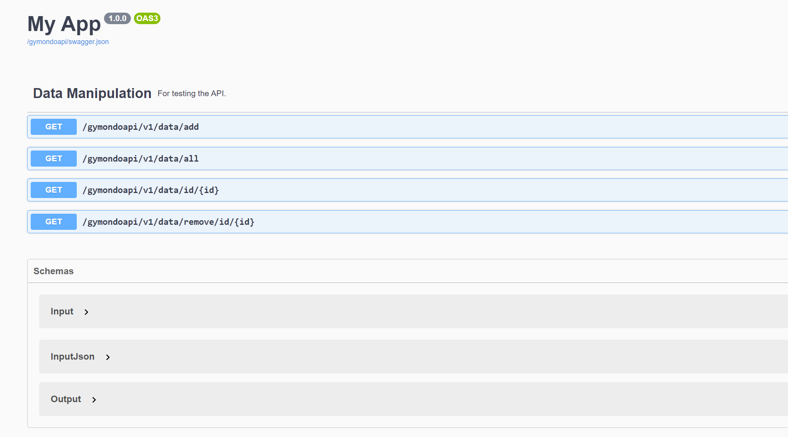

# The API
The api has been created using the Python Flask and hosted on the free hosting platfrom called pythonanywhere.
The endpoints are :

- http://mk007.pythonanywhere.com/gymondoapi/v1/data/all
- http://mk007.pythonanywhere.com/gymondoapi/v1/data/id/{id}
- http://mk007.pythonanywhere.com/gymondoapi/v1/data/add/{data}
- http://mk007.pythonanywhere.com/gymondoapi/v1/data/remove/id/{id}

The api is able to show, add, remove data from the data source.\

Usage:

The api is already hosted and that is why it is not necessary to do anything with the source code.
The hosting step is described below:

* Create a account in pythonanywhere.com
* Create a web app with their web section
* Upload the code and data into the pythonanywhere file system
* You must create a virtual environement and link the envronment with the created app.
    * The step to create and link virutal env is given in the link : https://help.pythonanywhere.com/pages/Virtualenvs/

If you want to play with the source code then please install anaconda or python virtual env to create a virtual env and install all the ncessary libraries/ modules mentioned the requirements.txt file. 

After that run the "flask run" command from the api folder. The api should start and you can test the api through the postman or any other api testing tool. 

There is also a test folder where some testing code is written using python pytest module. 

### Swagger

There is also a small swagger docs availabel to discribed the little gymondo rest api. 
You can check this out through the follwoing endpoint:

- http://mk007.pythonanywhere.com/gymondoapi/docs

This is a good standard way to document api.

# CLI
The cli was made to interact with the data through the gymondo api. The cli was created using the python Click library. This is an awesome tool to create simple easy to use user friednly cli.

For making the gymondo cli tool executable and usable, you must navigate to cli folder and run the following command.

- pip install --editable .

This will install the necessary libraries and make the click script usable for user.
After that you can use the cli through simple "gymondo" command.

If you run gymondo in terminal it will show all the necessary commands and argument you must given to interact with api.

Now, run "gymondo" in your terminal and you will see the help instructions.
